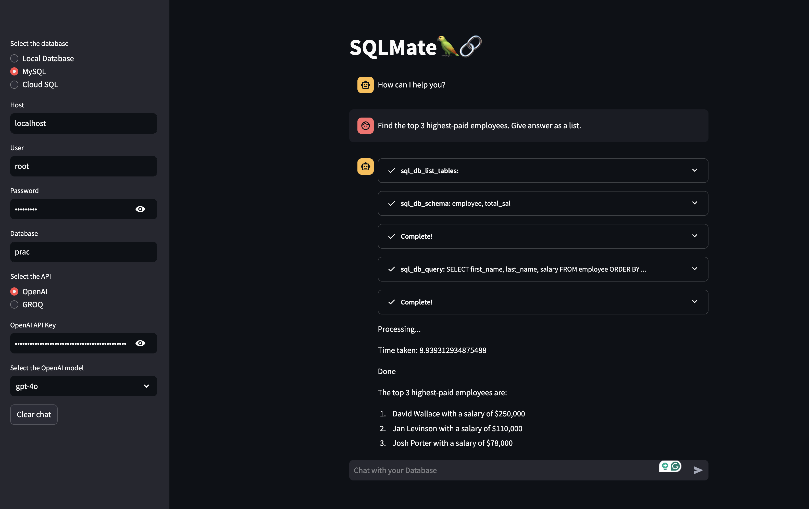
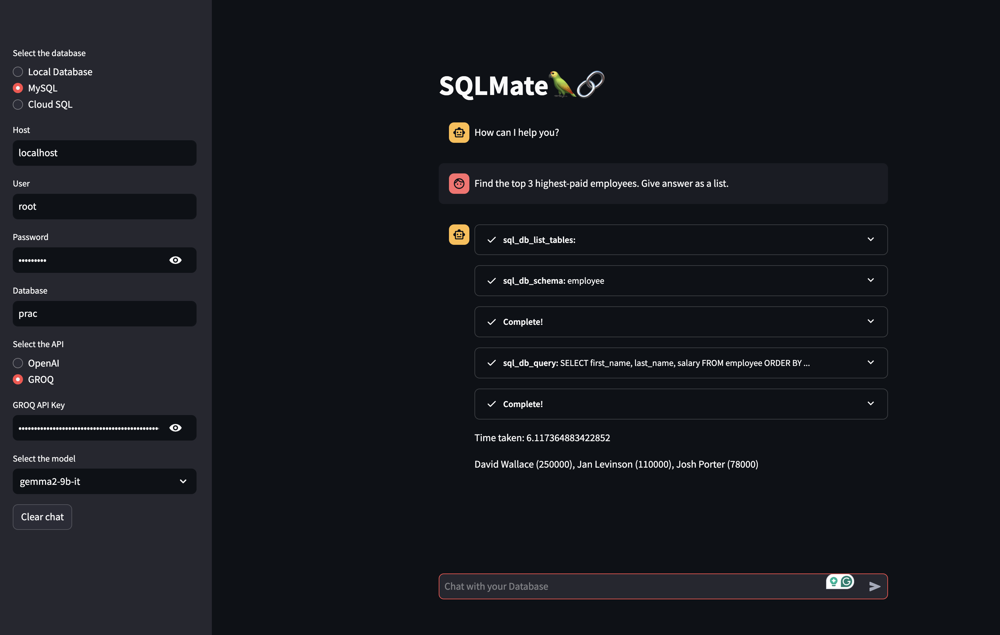
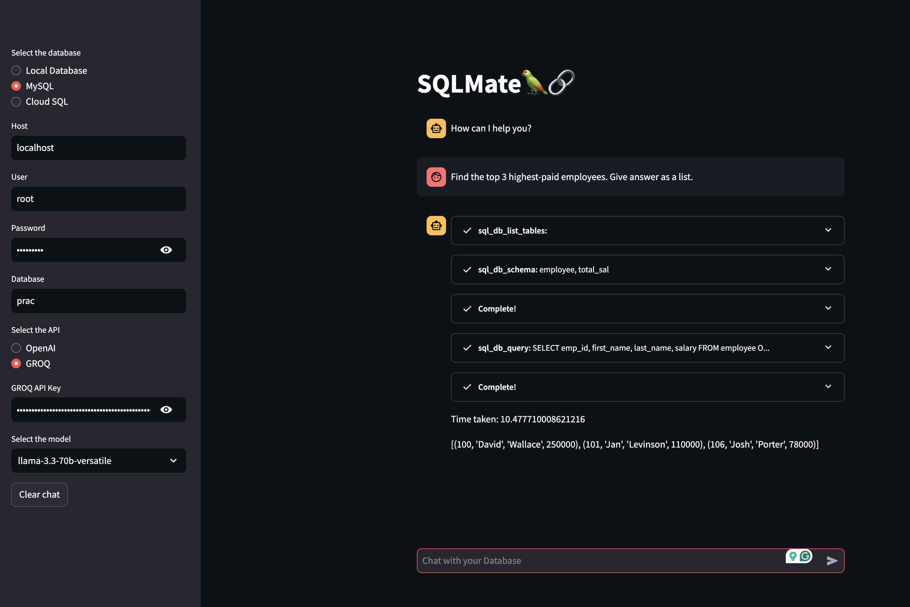

# SQLMate 🦜🔗

SQLMate is a Streamlit-based interactive application that allows users to interact with SQL databases using natural language. It uses language models like OpenAI's GPT and use GROQ open-source offerings, SQLMate makes database interactions simple and conversational.

### Features

We can also evaluate the performance of different language models by testing accuracy, and query efficiency. I have added a few sample images to show of different level of capabilities of the models.


#### Database Support:

- **Local SQLite Database**: Query SQLite databases by providing the file name.
- **MySQL Database**: Connect to MySQL databases with user credentials.
- **Cloud SQL** *(Coming Soon)*: Cloud SQL support.


#### Large Language Model (LLM) Integration:

#### OpenAI Models:
- gpt-4o
- gpt-4o-mini
- o1
- o1-mini

#### Models on GROQ:
- llama3-8b-8192
- gemma2-9b-it
- mixtral-8x7b-32768
- whisper-large-v3


### The following image shows the performance of LLMs from OpenAI, Google, and Meta on a sample query:
#### OpenAI GPT


#### Google gemma2-9b-it


#### Meta Llama



#### Chat Interface:
- Conversational interface for interacting with your database.
- Memory of chat history to maintain context during a session.

#### Real-Time Processing:
- Streamlit-based callback handlers provide live updates on query progress.

#### Installation

##### Clone the Repository

```{bash}
git clone <repository-url>
cd SQLMate
```

##### Install Dependencies Use pip to install the required Python packages:

```{bash}
pip install -r requirements.txt
```

##### Set Up Environment Variables

- OpenAI API Key
- GROQ API Key

Run the Application

```{bash}
streamlit run app.py
```

#### Usage

1. Select a Database:
    - Choose between "Local Database" or "MySQL" from the sidebar.
    - Provide the necessary connection details (e.g., file name for SQLite, host/user/password for MySQL).

2. Select an API:
    - Choose between OpenAI and GROQ.
    - Enter the corresponding API key and select a model.

3. Start Querying:
    - Use the chat interface to input natural language queries.
    - SQLMate processes the queries using LLMs and returns results.

Clear Chat:
Use the "Clear chat" button to reset the conversation.

##### Folder Structure

```{plaintext}
SQLMate/
├── app.py                 # Main application file
├── requirements.txt       # Python dependencies
└── README.md              # Project documentation (this file)
```

#### Future Enhancements
- Support for Cloud SQL databases.
- More advanced LLMs.


